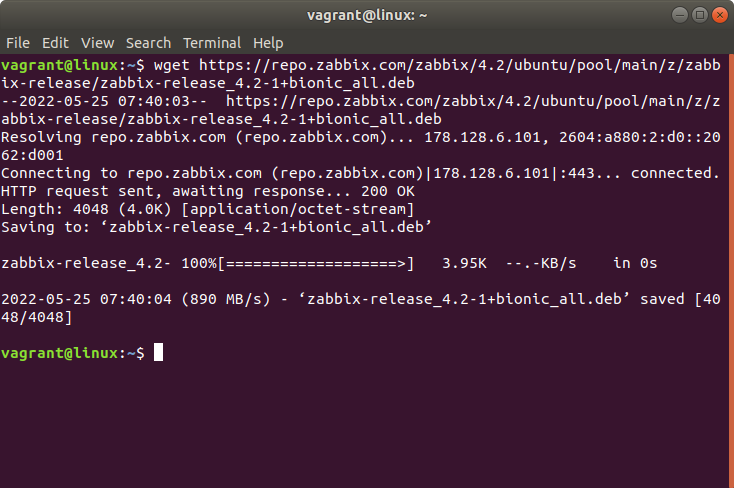

# zabbix

**1. Creo una máquina virtual  de Ubuntu y una vez creada inserto en la terminal el siguiente comando:**
wget https://repo.zabbix.com/zabbix/4.2/ubuntu/pool/main/z/zabbix-release/zabbix-release_4.2-1+bionic_all.deb
 

